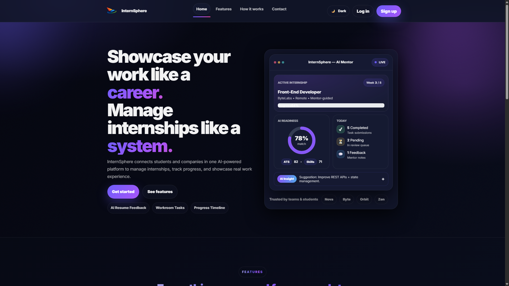
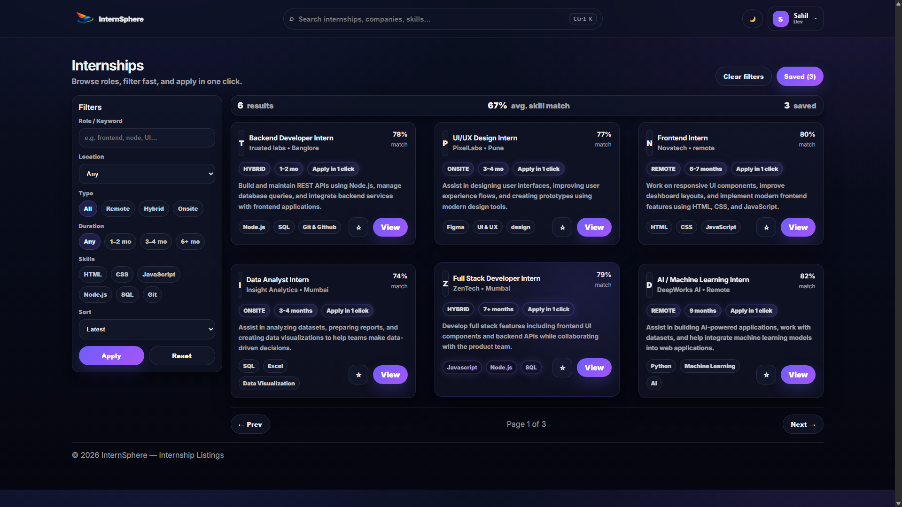

# InternSphere – AI Powered Virtual Internship Portal

[ GitHub Repository: https://github.com/sahil-7-dev/InternSphere](https://github.com/sahil-7-dev/InternSphere-)

## About the Project
InternSphere is an AI-powered virtual internship portal designed to simulate real-world internship experiences for students. 
The platform allows students to explore internships, complete tasks in a virtual workroom, and interact with an AI mentor while tracking their progress.

## Features
- AI Mentor Assistance
- Virtual Workroom
- Internship Listings
- Task Submission System
- Admin and Company Panels

## Project Screenshots

### 1. Landing Page

### 2. Internship Listing Dashboard

## Technologies Used
- HTML5
- CSS3
- JavaScript
- Firebase
- Vercel Hosting
